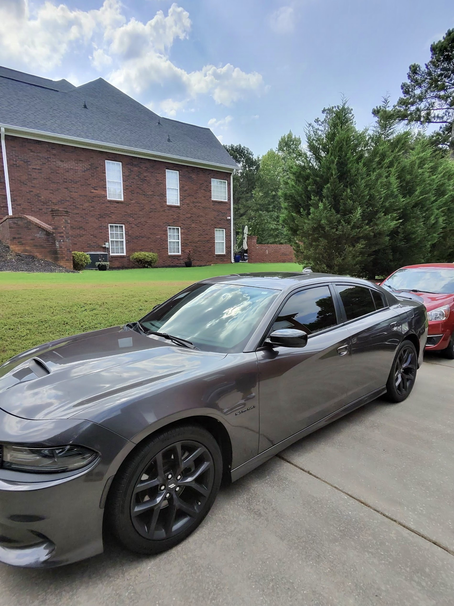
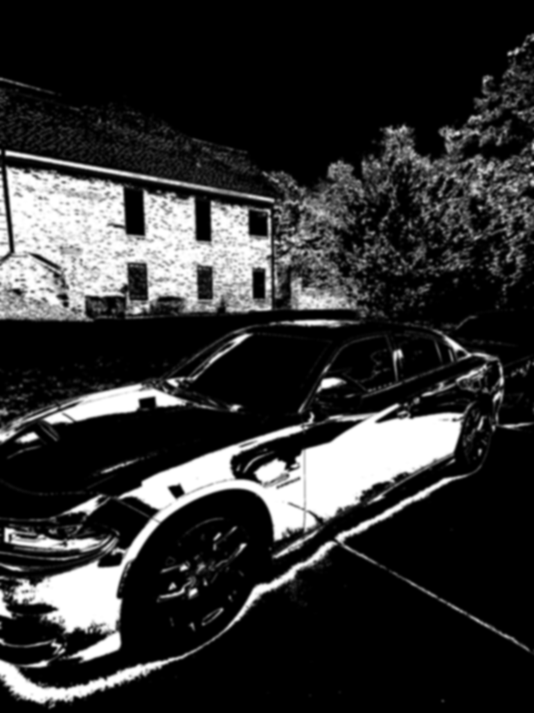

# car-recolor-visualizer

Recolors a car's body panels in a photo using a color-tolerance mask, while preserving the original lighting, reflections, and shadows — so the result still looks like real paint under real light, not a flat sticker.

**Status:** early-stage proof-of-concept. Not yet a client-ready tool.

## What it does

Given a photo of a car, the script:
1. Identifies the car's body panels in the image (the mask).
2. Blends a new color into just that region.
3. Keeps the original brightness/shadow pattern intact, so highlights and reflections carry over into the new color instead of being flattened out.

### Example

| Input | Mask | Result |
|---|---|---|
|  |  |  |

## How it works

There are two ways to generate the mask:

**Automatic color-tolerance mask (current default).** The script samples the car's paint color at one pixel, then selects every pixel in the image within a set color distance (`COLOR_TOLERANCE`) of that sample. Fast, no manual work — but only reliable on a fairly uniform paint color, and it has no concept of "this is a car" vs. "this is something else that happens to be a similar color."

**Hand-drawn mask (fallback, not yet wired into a UI).** For harder cases — multi-tone paint, strong reflections — you paint the body panels white and everything else black in any image editor, save it as a mask, and point the script at it instead. More accurate, more manual effort.

## Limitations

The example above shows this clearly: look closely at `debug_mask.png` and you can see the mask also picked up parts of the house siding and trees in the background, not just the car. That's the automatic approach doing exactly what it's designed to do — selecting anything close to the sampled color — with no understanding of "car" vs. "background." On this photo it didn't visibly break the final output, but on a photo where the background color is closer to the paint, it would bleed into the result. This is the specific limitation that motivates the hand-drawn mask fallback above.

Other current limitations:
- Single flat color only — no gradients, patterns, or multi-color wraps yet.
- No batch processing — one photo in, one photo out.
- Mask quality is untested across lighting conditions, angles, or paint finishes beyond this one example photo.

## Usage

```bash
pip install -r requirements.txt
```

Place a car photo at `examples/input.jpeg`, then run:

```bash
python car_recolor.py
```

This generates `examples/debug_mask.png` (so you can see exactly what got selected) and `examples/output_recolored.png` (the final result).

Adjust `NEW_COLOR`, `BLEND_STRENGTH`, `SAMPLE_POINT`, and `COLOR_TOLERANCE` in the config section at the top of `car_recolor.py` to tune the result for a different photo.

## Next steps

- Multiple color variants generated from a single input photo
- A small before/after portfolio across different cars and paint colors
- Tighter mask logic (e.g. edge-aware selection) to reduce background bleed
- Eventually: a simple interface for non-technical use# car-recolor-visualizer
Recolors a car's body panels in a photo using Python/PIL/NumPy — automatic color-tolerance masking with a hand-drawn mask fallback. Early-stage proof-of-concept, not yet a client-ready tool.
